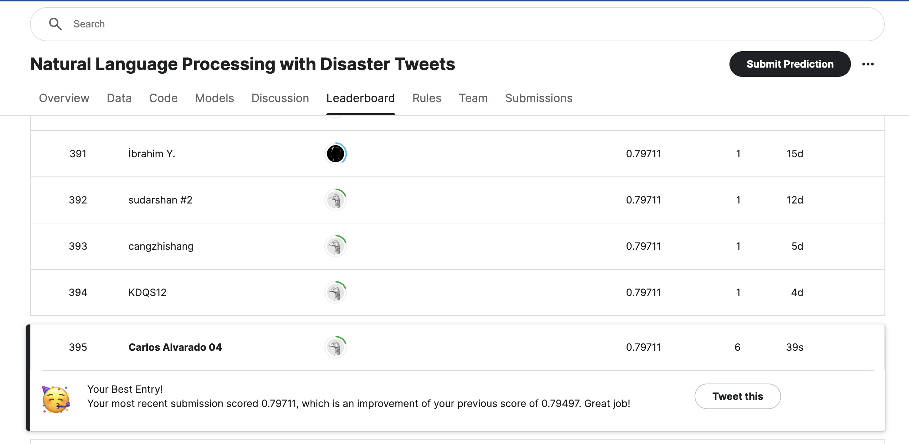

### Introduction

In this notebook, we will work on the [Natural Language Processing with Disaster Tweets](https://www.kaggle.com/c/nlp-getting-started) competition on Kaggle. The goal is to build a machine learning model that predicts which Tweets are about real disasters and which ones are not.

We will perform the following steps in this notebook:
1. Exploratory Data Analysis (EDA): We will explore the dataset to understand the data and its distribution.
2. Data Preprocessing: We will preprocess the text data to prepare it for training.
3. Model Building: We will build a deep learning model using TensorFlow/Keras.
4. Model Training: We will train the model on the training data.
5. Model Evaluation: We will evaluate the model on the validation set.
6. Submission: We will make predictions on the test set and submit them to the competition.

### Dataset

The dataset consists of the following files:
- `train.csv`: The training set with labeled data.
- `test.csv`: The test set with unlabeled data.
- `sample_submission.csv`: A sample submission file in the correct format.

### Author

- Carlos Alvarado Martinez

### Exploratory Data Analysis (EDA)

**Dataset Description:**
- **Files used:**
  - `train.csv`: Training set with labeled data
  - `test.csv`: Test set with unlabeled data
  - `sample_submission.csv`: Sample submission file
- **Columns in the dataset:**
  - `id`: Unique identifier for each tweet
  - `text`: Text content of the tweet
  - `location`: Location from where the tweet was sent (may be blank)
  - `keyword`: A keyword from the tweet (may be blank)
  - `target`: Target label indicating if the tweet is about a real disaster (1) or not (0)

**Initial Data Inspection:**
- Displayed the first few rows of the dataset to understand its structure and content.
- Noted missing values in the `keyword` and `location` columns.

### Methodology

**Text Preprocessing:**
- **Text Vectorization:**
  - Used `TextVectorization` to convert tweet text into integer sequences.
  - Configured to use a maximum of 10,000 tokens and a sequence length of 150.

**Model Building:**
- Built a Sequential model using TensorFlow and Keras:
  - **Layers:**
    - `Embedding` layer to convert token integers into dense vectors of fixed size.
    - `GlobalAveragePooling1D` to down-sample the input.
    - `Dense` layer with ReLU activation for learning features.
    - Output `Dense` layer with Sigmoid activation for binary classification.
  - **Compilation:**
    - Used `Adam` optimizer with an initial learning rate of 0.001.
    - Loss function: `binary_crossentropy`.
    - Metrics: `accuracy`.

**Model Training:**
- **Callbacks:**
  - `EarlyStopping`: Monitored `val_accuracy` with a patience of 10 epochs to prevent overfitting.
  - `ReduceLROnPlateau`: Reduced learning rate on plateau in `val_accuracy` with a factor of 0.2 and a minimum learning rate of 0.00001.
- Trained the model for 50 epochs with a batch size of 32 and a validation split of 20%.

**Performance Monitoring:**
- Recorded training and validation accuracy and loss for each epoch.
- Adjusted learning rate based on the performance on the validation set.

### Conclusions

**Training Results:**
- **Initial Performance:**
  - The model's accuracy started improving after a few epochs.
  - Observed a validation accuracy of around 77.68% with a loss of 0.5419 in the later epochs.
- **Adjustments:**
  - Learning rate adjustments helped in stabilizing the training process.

**Final Submission:**
- Predicted the target labels for the test set using the trained model.
- Prepared the submission file `submission.csv` as required by the competition.

**Score and Leaderboard Position:**
- Achieved a public score of 0.79711.
- Ranked 395 on the leaderboard with this score.

### Score and Leaderboard Position

